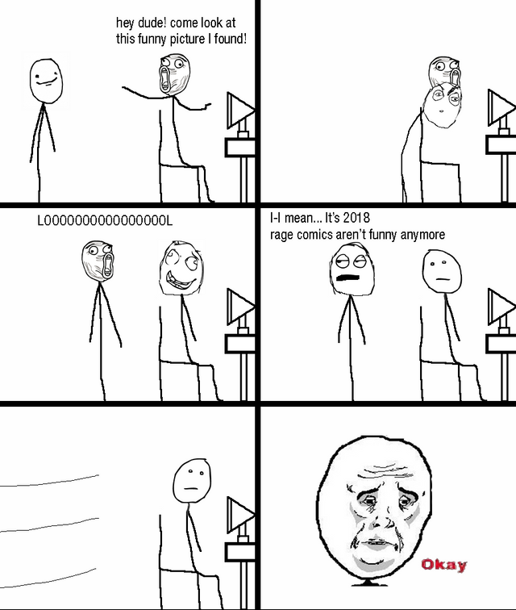
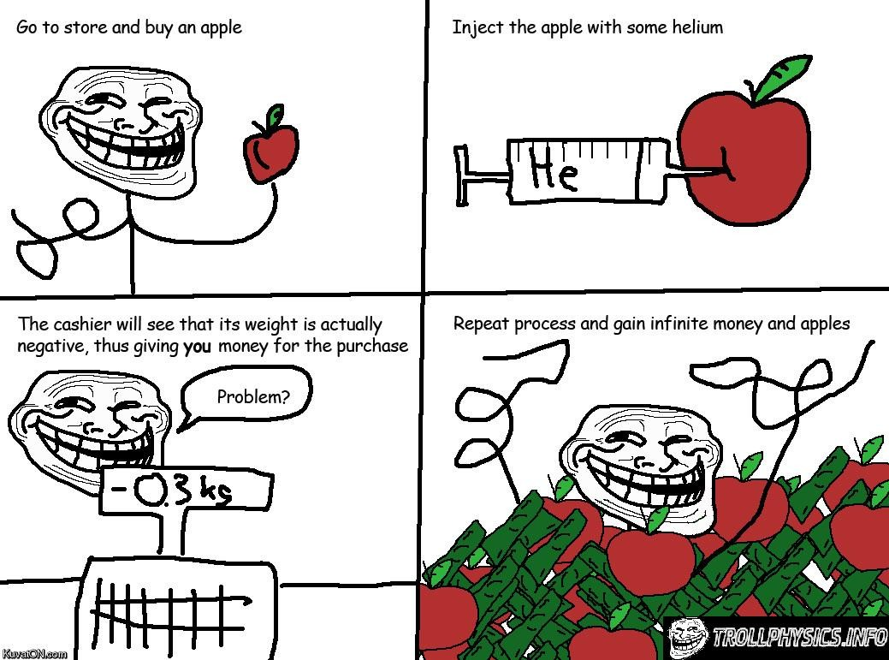
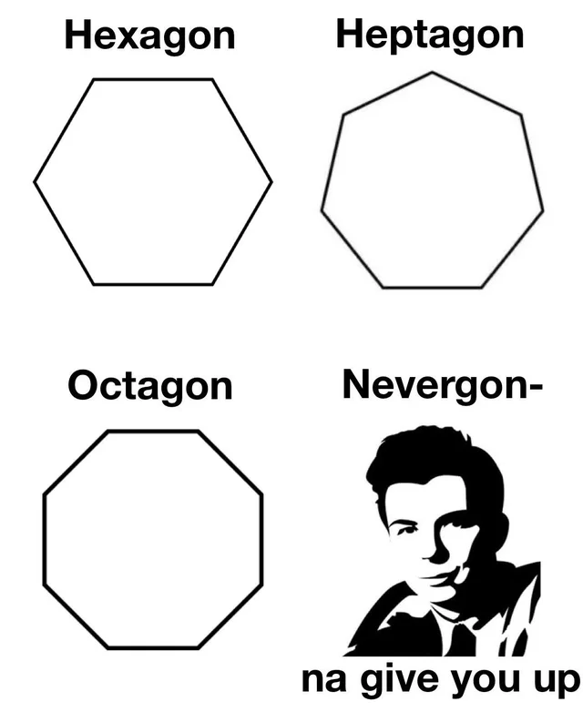

# Hien To's User Page
## Index:
- [Hien To's User Page](#hien-tos-user-page)
  - [Index:](#index)
  - [Who am I?](#who-am-i)
    - [***Introduction (as a person)***](#introduction-as-a-person)
    - [***Introduction (as a programmer)***](#introduction-as-a-programmer)
    - [***Personal memes corner***](#personal-memes-corner)
      - [**My _top 5_ favorite memes**](#my-top-5-favorite-memes)
      - [**Honorable mentions**](#honorable-mentions)
    - [A subset of my TO-DO list](#a-subset-of-my-to-do-list)
  - [Links](#links)
    - [***Relative links***](#relative-links)
    - [***Important links***](#important-links)
## Who am I? 
### ***Introduction (as a person)***
Hello there, my name is **Hien To**, currently an undergraduate at UCSD majoring in Mathematics-CS. I am from Hanoi, the capital city of Vietnam. My hobbies revolves around travelling to different cultures, binge watching series (and Youtube), playing games, solving problems (puzzles, math or CS), and most importantly, *browsing memes* and ~~rickrolling people~~. My favorite video game of all time is *Super Paper Mario*, but currently it is *Animal Crossing* (which I have almost 300 hours in), and my favorite character in the Nintendo Universe is *Kirby*. Also, my favorite lines of code are `up up down down left right left right B A` (Konami code) and `printf("hello, world\n");`. 
### ***Introduction (as a programmer)***
I was first introduced to programming when I was a primary school student, where it was just a simple drag-and-drop JavaScript basics (loops, variables, etc.). Then, in middle school, the school made us code in Pascal, which was a rather laborious time. Skipping to high school, I joined an app developing club, which I learned to program in *Swift* and participated in creating a few IOS applications for the school. I also learned *Java* and *JavaScript* offered by computer science classes, and self-studied *Python* and *Arduino*. Then, I got into ***UCSD*** and continues the programmer journey. Ideally, I would like to learn more about **Computer Vision _and/or_ Cybersecurity**, which are the two fields that appeals to me the most in the vast sea of Computer Science and Engineering. This path might seems long and filled with hardship, but as wise beings always say about following one's dream:
>Never gonna give you up,
>Never gonna let you down,
>Never gonna run around and desert you.

### ***Personal memes corner***
#### **My _top 5_ favorite memes**
 **1. Rage comics** 
   
   

 **2. Troll physics** 
   
   
   
 **3. Meme doge** 
 
   
   
 **4. Math memes** 
    
   
   
 **5. Rickroll** 
  
   
  
#### **Honorable mentions**
 - Spanish inquisition (You never expected this)
 - Spongebob
 - Soviet Russia 
 - E
 - What's this? A crossover episode?

### A subset of my TO-DO list
- [x] Go to university
- [x] Finish this assignment
- [ ] Finish the rest of my assignments
- [ ] Be happy
- [ ] Exterminate emojis
- [ ] Become a 10x programmer 
- [ ] Have a vaccation in space

## Links
### ***Relative links***
[Link to the near-empty README](README.md) 

[Link to life lesson](lemons.png)

### ***Important links***
[Watch this](https://www.youtube.com/watch?v=dQw4w9WgXcQ),
[And this](https://www.youtube.com/watch?v=yKQ_sQKBASM),

[My favorite de-stress song](https://www.youtube.com/watch?v=9lVPAWLWtWc) 
